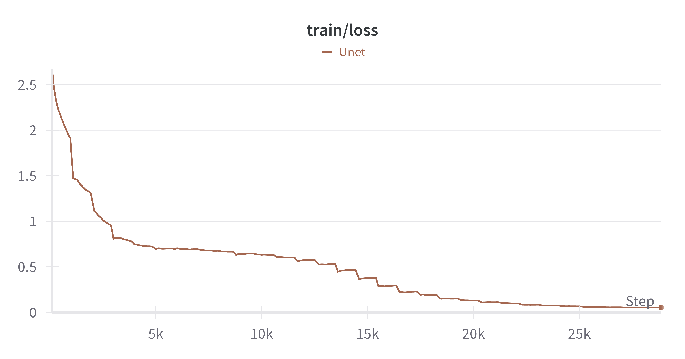
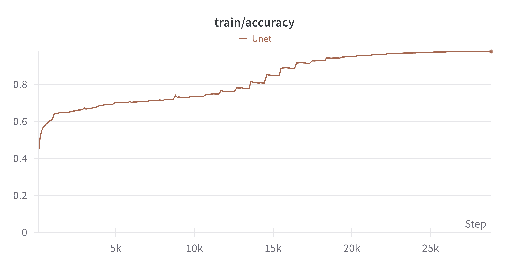
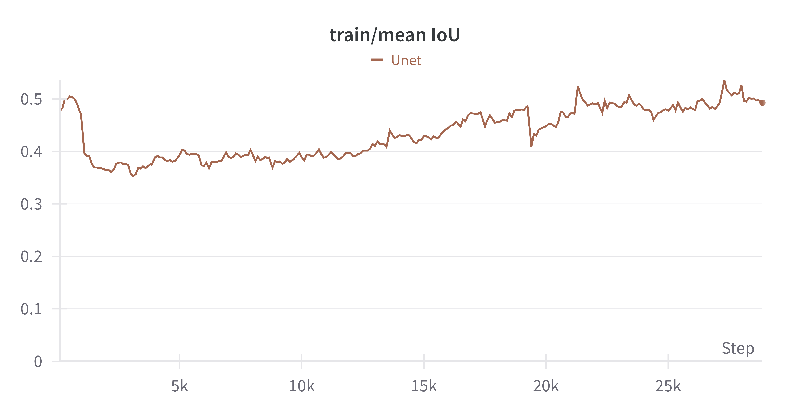
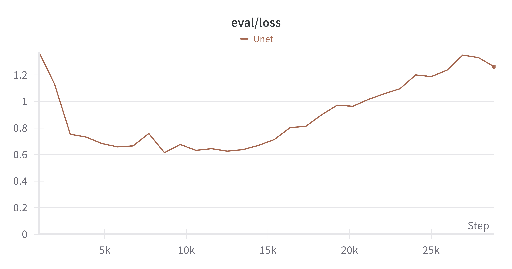
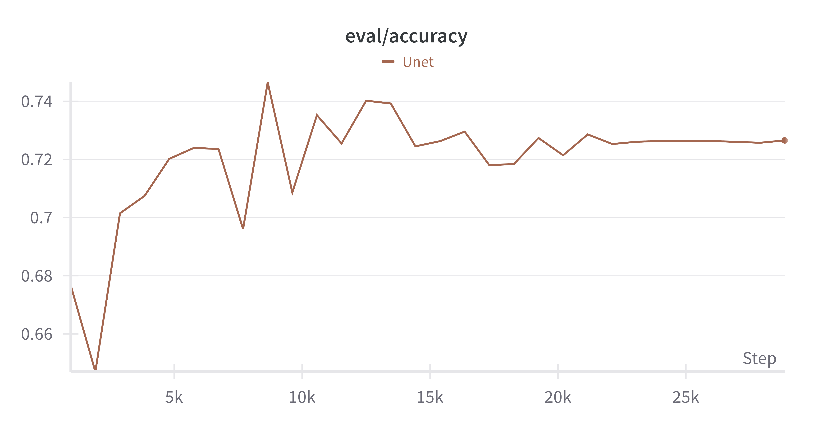
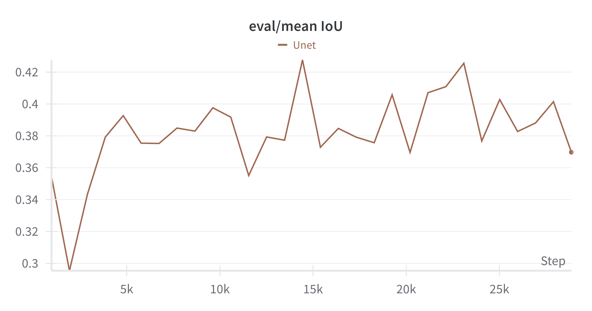

# Unet

## Table of content
- [Introduction](#introduction)
- [Getting started](#getting-started)
- [Experiments](#experiments)
- [Future works](#future-works)
- [Contact](#contact)

## Introduction

Welcome to the Unet Image Segmentation project! This repository implements the Unet model using **Pytorch**, designed for image segmentation tasks.

In this repository, you'll find:

- Implementation of Unet: Detailed implementation of the Unet model in **Pytorch**.
- Training Scripts: Scripts for training the model on your own dataset.
- Evaluation and Inference: Tools for evaluating model performance and making predictions.
- Example Notebooks: Jupyter notebooks demonstrating usage and showcasing results.

Whether you're new to image segmentation or looking to explore the capabilities of Unet, this project aims to provide a clear and practical implementation. Feel free to explore, use, and contribute to further enhance the capabilities of image segmentation in your applications.

## Model Architecture

The architecture of Unet in this implementation closely follows the original Unet architecture proposed by Olaf Ronneberger, Philipp Fischer, and Thomas Brox in their seminal paper, "U-Net: Convolutional Networks for Biomedical Image Segmentation" ([link](https://arxiv.org/abs/1505.04597)). 

The architecture can be illustrated as following image


## Getting started

To get started, follow these following simple steps:

**1. Clone this project**
```bash
https://github.com/uvipen/Hierarchical-attention-networks-pytorch.git
```

**2. Setup Python environment**

Create Python virtual environment
```bash
cd Unet # To ensure you are in project directory
python3.12 -m venv .venv 
```

Activate it

- MacOS/Linux
```bash
source .venv/bin/activate
```

- Windows
```bash
.venv\Scripts\activate
```

Install necessary packages
```bash
pip install -U pip # upgrade pip
pip install -r requirements.txt
```

## Experiments

### Datasets

| Dataset | classes | Train samples | Validation samples | Test samples | Reference |
|---|---|---|---|---|---|
| **BCSS** | 22 | 30760 | 5429 | 4021 | [link](https://www.kaggle.com/datasets/whats2000/breast-cancer-semantic-segmentation-bcss) |
| **Carvana** (future works) | - | - | - | - | [link](https://www.kaggle.com/c/carvana-image-masking-challenge/data)

### Training

**1. Computing resources**

2 GPU T4 on Kaggle.

**2. How to train**

Currently, my model has not performed as well as I expected, so I have still not implemented both `train.py` and `inference.py` files. You can use this [notebook](https://github.com/PhuongBui712/Unet/blob/main/notebooks/BCSS_Unet.ipynb) to train and evaluate your model.

Moreover, you can watch my [Kaggle notebook](https://www.kaggle.com/code/phuongbui10c13/unet-breast-cancer-semantic-segmentation/notebook). This notebook has a few difference comparing with `BCSS_Unet` which is suited to training model on Kaggle.

### Result

**Training result**
- Train Loss



- Train Accuracy



- Train Mean IoU



**Validation result**
- Validation Loss



- Validation Accuracy



- Validation Mean IoU



## Future works

1. Enhancing Unet performane by changing architecture: add more blocks, integrate Resnet, etc.
2. Training on multiple datasets
3. Implement `train.py` and `inference.py`
4. Containerize project by Docker

## Contact

- **Email**: Buitanphuong712@gmail.com